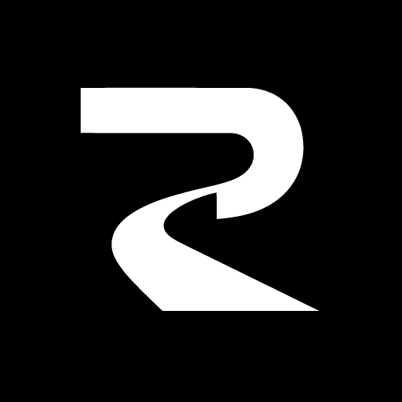

  

<h1 align="center">RahRow</h1>

  A simple way to use your VPN connections on all yokour devices.

  
  

## What is RahRow?

A VPN helps your internet traffic travel through another connection. RahRow is
the app that lets you add that connection, choose it, and turn it on or off.

You usually receive a link or a subscription from a VPN provider. Add it to
RahRow, pick a connection, and press **Connect**.

> [!NOTE]
> RahRow is still being built. Some apps and downloads are not ready for
> everyday use yet.

## What can it do?

- Add VLESS, VMess, and Trojan connection links
- Import a subscription with many connections
- Save connections and switch between them
- Connect, disconnect, and show what is happening
- Choose Xray or sing-box before connecting
- Check whether a connection responds
- Import or share connections with QR codes where supported
- Keep the desktop and mobile experience familiar

## Apps

| App | Made for |
| --- | --- |
| **CLI** | People who prefer using a terminal |
| **macOS** | Mac computers |
| **iOS** | iPhone and iPad |
| **Linux** | Linux computers |
| **Android** | Android phones and tablets |
| **Windows** | Windows computers |

What do I need?

You need a VLESS, VMess, or Trojan connection from a provider or someone you
trust. RahRow does not sell VPN access or create an account for you.

## Project status

RahRow is an open-source project under active development. Expect rough edges
and missing platform features while the apps are prepared for public releases.

## Production contract

RahRow is designed as a production-ready, installable end-user product, not a
shell around tools the user must install separately. A release must produce one platform-native
distributable—such as a Windows installer, macOS app bundle, or Android APK—that
contains every engine it advertises. Engines may be internal sidecars or native
libraries inside that distributable; they must not be fetched on first launch.

Xray and sing-box are the first bundled engines. The selected engine is stored
in Settings and used for the next connection. An engine that owns an active
connection remains responsible for stopping it, preventing unsafe mid-process
handoffs.

### Connection modes

VPN/TUN is the default. A supported build registers a VPN with the operating
system and routes device traffic through its native tunnel facility: Android
`VpnService`, an Apple Network Extension, or the corresponding desktop tunnel
provider. Starting a local SOCKS listener alone is not called a VPN.

System proxy is an explicit fallback. RahRow starts the selected bundled engine,
applies the OS proxy only after that engine is ready, and restores proxy settings
when the connection stops. It never silently changes VPN mode into proxy mode.
If a build lacks the required native tunnel entitlement or provider, VPN mode
fails closed and diagnostics report the missing capability.

### Protocol support

| Status | Protocols and features |
| --- | --- |
| Implemented | VLESS, VMess, Trojan; V2Ray/Xray subscription links; TLS, REALITY, VLESS Vision, uTLS; WebSocket, TCP, gRPC, HTTP Upgrade |
| Committed roadmap | Shadowsocks; Hysteria and Hysteria2; SSH; V2Ray JSON import |
| Additional engine adapters required | Ping Tunnel and DNS tunnel/DNSTT |

Shadowsocks support will include the modern AEAD methods
`aes-128-gcm`, `aes-192-gcm`, `aes-256-gcm`,
`chacha20-ietf-poly1305`, and `xchacha20-ietf-poly1305`. A roadmap entry is not
reported as supported until its profile schema, import/export path, engine
configuration, and integration tests are complete.

Found a problem or have an idea? [Open an issue](https://github.com/FalseFoundation/rahrow/issues).

RahRow is available under the [MIT License](LICENSE).
